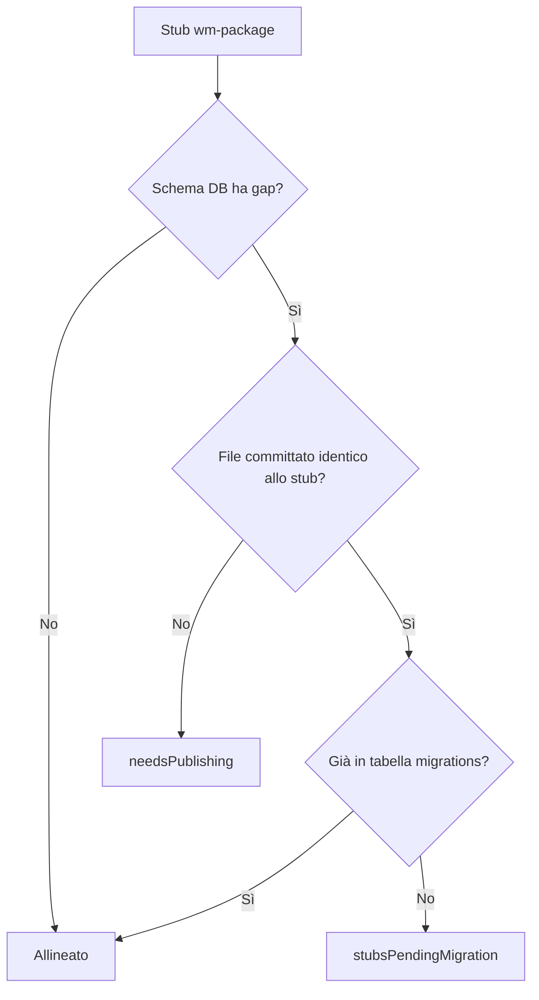

> Ticket: oc:8218

# Comandi wm-package per migration stub obbligatori

## Design finale

Il ticket oc:8218 (lato consumer) chiedeva `vendor:publish` in deploy + gate CI filesystem. Implementazione attuale:

- **Niente publish in deploy** — file migration solo via git
- **Gate CI** — `publish-missing-migrations --dry-run` dopo `migrate` (stesso DB dei test)
- **Stub obbligatori** — verifica semantica sullo schema DB, non suffisso file

Pipeline CI/CD e casi d'uso end-to-end: `maphub/docs/features/8218-cicd-migration-wm-package-permission-cache/overview.md`.

---

## Diagramma gate per stub

---

## Comandi

| Comando | DB | Ruolo |
|---------|-----|--------|
| `wm-package:publish-missing-migrations` | Sì | Workflow principale: pubblica stub il cui effetto manca sul DB |
| `wm-package:publish-missing-migrations --dry-run` | Sì | Gate CI consumer; exit non-zero se non allineato |
| `wm-package:publish-migration <stub>` | Sì | Publish singolo stub; ignora falsi positivi da suffisso |

---

## `publish-missing-migrations` — logica

Per ogni `*.php.stub` in `database/migrations/` del package:

1. Estrae tabelle/colonne/ruoli attesi (parser euristico su `Schema::create/table`, `insertOrIgnore` ruoli)
2. Confronta con **schema DB reale** del consumer (`schemaGapsForStub`)
3. Se **nessun gap** → stub allineato (`isAppliedToDatabase`)
4. Se gap **e** esiste file committato **identico** allo stub → `stubsPendingMigration` (serve `migrate`)
5. Se gap **e** nessun file identico → `needsPublishing` → pubblica `database/migrations/<timestamp>_<stub>.php`

### `--dry-run`

- Exit `0` se tutti gli stub allineati
- Exit `1` se `needsPublishing` o `stubsPendingMigration` non vuoti
- Elenca stub e gap (`manca colonna users.balance`, ecc.)

---

## `publish-migration <stub>` — differenza da suffisso

Non si ferma se esiste un file con lo **stesso suffisso** ma **contenuto diverso** (es. `0001_..._create_users_table.php` Laravel vs stub wm-package con `Schema::table`).

Ordine dei controlli:

1. Stub esiste?
2. Schema già applicato? → exit `0`, nessuna azione
3. File identico committato ma non migrato? → exit `1`, suggerisce `migrate`
4. Altrimenti pubblica (anche con suffisso diverso o contenuto diverso)

---

## Casi d'uso (lato comando)

| Scenario | `needsPublishing` | `stubsPendingMigration` | `--dry-run` | Azione |
|----------|-------------------|-------------------------|-------------|--------|
| Schema già completo sul DB | false | false | pass | Nessuna |
| Gap schema, nessun file identico | true | false | fail | `publish-missing-migrations` o `publish-migration` |
| File identico in git, non migrato | false | true | fail | `migrate` |
| Suffisso uguale, contenuto diverso (`create_users_table`) | true | false | fail | Pubblica stub wm-package |
| Schema già ok via migration custom (nome diverso) | false | false | pass | Nessuna |

---

## Trait condiviso

`InteractsWithWmPackageMigrationStubs` centralizza:

- Lookup stub e file pubblicati (suffisso e contenuto)
- `schemaGapsForStub`, `isAppliedToDatabase`, `needsPublishing`
- `publishStubToProject`

---

## Requisiti

- [x] Due comandi registrati in `WmPackageServiceProvider`
- [x] Trait condiviso
- [x] `--dry-run` con exit code per gate CI
- [x] `publish-migration` ignora suffisso se contenuto diverso
- [x] Test Feature

## Rischi

- Parser schema dagli stub — euristica; stub con sole FK/indici senza colonne estratte usano fallback su migration eseguita per suffisso
- Deploy manuale senza CI — non mitigabile senza restrizioni container

## Moduli toccati

- `src/Commands/Concerns/InteractsWithWmPackageMigrationStubs.php`
- `src/Commands/WmPackagePublishMigrationCommand.php`
- `src/Commands/WmPackagePublishMissingMigrationsCommand.php`
- `src/WmPackageServiceProvider.php`
- `tests/Feature/WmPackagePublish*CommandTest.php`, `InteractsWithWmPackageMigrationStubsTest.php`
